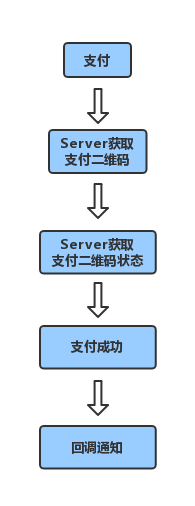

比特派 APP 支付
=======================

比特派 APP 支付流程图

说明：

1、通过用户登录 API 登录。

2、获取用户信息（最重要的是 token ）。

3、需要在 HTTP 的请求头中设置 "open-access-token" 键值对。

获取支付二维码
---------------

        **请求 API **:
            * ``url`` */api/v1/open/third/party/{coin_code}/pay/qr/create*
            * ``method`` *POST*
            * ``content-type`` *application/json*

        ** header **:
            * ``open-access-token`` *token* *登录之后通过获取用户信息 API 获取*

        ** 参数 **:
            * ``appkey`` *(String)* -参数类型, *(App 标识)*
            * ``transfer_id`` *(String)* -参数类型, *订单号*
            * ``amount`` *(String)* - 参数类型, *金额*

        ** 返回值 **:
            * ``time`` *时间戳*
            * ``qr_info``
            * ``qr_url``

        ** 返回值举例 **::

                {"qr_url": "http://*/qr_img/2afbd4e0cfdb4931b72f1ec4fef2e09b.png", "qr_info": "****:pay:BTC:1:6031024934", "time": 1535023817}

获取支付二维码状态
-------------------------

        ** 请求 API **:
            * ``url`` */api/v1/open/third/party/pay/qr/query*
            * ``method`` *GET*
            * ``content-type`` *application/json*

        ** header **:
            * ``open-access-token``  *token* *登录之后通过获取用户信息 API 获取*

        ** 参数 **:
            * ``appkey`` *(String)* - 参数类型, *(App 标识)*
            * ``transfer_id`` *(String)* -参数类型, *订单号*

        ** 返回值 **
            * ``transfer_id`` *(String)* -参数类型, *订单号*
            * ``status`` *订单状态值  0初始化   1扫描支付   2支付成功  3支付超时*

        ** 返回值举例 **::

                {"transfer_id":"7078421366","status":"0"}

比特派 Bitpie 支付成功回调
--------------------------------------------------

说明：

支付成功回调名称是 PIEOPEN KEY 注册时填写的名称，此 API 由接入提供。由开放平台调用。

支付成功回调验证签名算法规则：

1、参数 message、签名不参。

2、参数名ASCII码从小到大排序（字典序）。

3、如果参数的值为空不参与签名。

4、参数名区分大小写。

5、汉字为utf8编码。

6、最后加入secretkey，参数名为 key ，secretKey是与Bitpie约定生成。

7、使用 SHA256 算法生成32位字符串。

Node.js:

::

    //以下是开放平台调用支付成功回调接口的参数
    {
    "coin_code":"BTC",
    "timestamp":"1535072985670",
    "amount":"1",
    "user_asset_flow_id":"2238368",
    "transfer_id":"5365715050",
    "sign_string":"7fd142cf4b285d2e59b54a5c7fd2fd3a30d8744f7c99e43cccb796c81e205da2",
    "balance":1136390130,
    "nonce_string":"0e2bf22e540a89627e16abc03d1d030f5cb6c9f9720bfb8d0ddef7ee61a50855"
    }
    //以下是通过比特派规定签名算法规则拼接字符串
    //amount=1&balance=1136390130&coin_code=BTC&nonce_string=0e2bf22e540a89627e16abc03d1d030f5cb6c9f9720bfb8d0ddef7ee61a50855&transfer_id=5365715050&timestamp=1535030243495&user_asset_flow_id=2238368&key=2223Dy221Afw50
    var crypto = require('crypto');
    var validation = crypto.createHash('sha256').update('amount=1&balance=1136390130&coin_code=BTC&nonce_string=0e2bf22e540a89627e16abc03d1d030f5cb6c9f9720bfb8d0ddef7ee61a50855&transfer_id=5365715050&timestamp=1535030243495&user_asset_flow_id=2238368&key=2223Dy221Afw50').digest('hex');
    console.log(validation);
    //validation: 7fd142cf4b285d2e59b54a5c7fd2fd3a30d8744f7c99e43cccb796c81e205da2
    //validation与sign_string进行比对。

::

每次交易和回调，双方都需要验证签名来保证交易的安全性。如果签名验证失败表明即表明本次交易失败。

        ** 请求 API **:
            * ``url`` */api/pay/callback*
            * ``method`` *POST*
            * ``content-type`` *application/json*

        ** 参数 **:
            * ``transfer_id`` *(String)* -参数类型, *订单号*
            * ``nonce_string`` *(String)* -参数类型, *签名验证随机值*
            * ``sign_string`` *(String)* -参数类型, *签名验证随机值*
            * ``amount`` *(String)* -参数类型, *币数*
            * ``coin_code`` *(String)* -参数类型, *币种代码,例 BTC*
            * ``user_asset_flow_id`` *(String)* -参数类型, *比特派 Bitpie 交易流水号*
            * ``balance`` *(String)* -参数类型, *[true|false] 默认 true*
            * ``timestamp`` *(String)* -参数类型, *交易时间,毫秒级时间戳,没有小数点,纯数字*

        ** 返回值 **
            * ``result`` *(String)* -参数类型, *[true|false]*