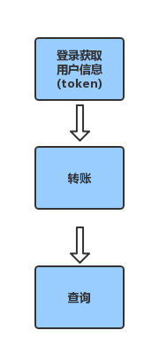

比特派 Bitpie 转账
=================================

比特派转账流程图：

说明：

通过用户登录 API 登录，登录之后通过获取用户信息 API 获取 token。

转账
--------------

说明：

此接口的签名 sign_string 是通过 SHA256 算法生成32位字符串。

签名算法规则：

1、参数 message、签名不参。

2、参数名 ASCII 码从小到大排序（字典序）。

3、如果参数的值为空不参与签名。

4、参数名区分大小写。

5、汉字为utf8编码。

6、最后加入secretkey，参数名为 key ，secretKey是与Bitpie约定生成。

7、使用 SHA256 算法生成32位字符串。

      ** API **
         * ``url`` */api/v1/open/third/party/transfer*
         * ``method`` *POST*
         * ``content-type`` *application/json*

      ** Header **
         * ``open-access-token`` *token* *登录之后通过获取用户信息 API 获取*

      ** 参数 **
         * ``app_key`` *(String)* -参数类型
         * ``user_id`` *(String)* -参数类型, *用户 bitid*
         * ``coin_code`` *(String)* -参数类型, *币种代码*
         * ``amount`` *(String)* -参数类型, *币种数量*
         * ``transfer_id`` *(String)* -参数类型, *订单号*
         * ``sign_string`` *(String)* -参数类型
         * ``nonce_string`` *(String)* -参数类型
         * ``timestamp`` *(String)* -参数类型

      ** 返回值 **
         * ``status`` * 00000 成功,12208 重复*
         * ``coin_code`` *币种代码*
         * ``balance``
         * ``user_asset_flow_id`` *流水号*

      ** 返回值举例** ::

             {"status":"00000","coin_code":"BTC","balance":1136390133,"user_asset_flow_id":138576}

转账查询
---------------------

      ** API **
         * ``url`` */api/v1/open/third/party/app/{app_key}/flow/{transfer_ids}*
         * ``method`` *GET*
         * ``content-type`` *application/json*

      ** Header **
         * ``open-access-token`` *token* *登录之后通过获取用户信息 API 获取*

      ** 参数 **
         * ``app_key`` *(String)* -参数类型
         * ``transfers_id`` *(String)* -参数类型, *订单号*

      ** 返回值举例** ::

            [{"balance_before_str":"0","coin_code":"BTC","fee":0,"user_id":102310,"flow_type":101,"flow_detail":{"vendor_app_id":"4","flow_detail":"{\"coin_code\": \"BTC\", \"app_key_id\": 4, \"from_flow_id\": 138576, \"timestamp\": \"1535080871335\", \"to_flow_id\": 138577, \"amount\": 1, \"from_user_id\": 102310, \"to_user_id\": 100615}","flow":null,"user_asset_flow_id":138576,"vendor_flow_id":"3935240840","user_asset_flow_detail_id":60432},"balance_after_str":"0","create_at":"2018-08-24T03:21:11","fee_str":"0","balance_before":1136390134,"amount":1,"action_object_id":100615,"amount_str":"0","user_asset_flow_id":138576,"balance_after":1136390133,"fee_type":0}]