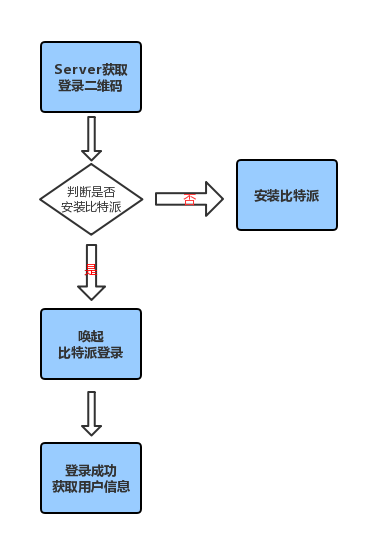

比特派 APP 唤起
=================================

比特派唤起流程图

说明：

1、比特派唤起前先请求登录二维码。

2、判断是否安装比特派。

3、唤起比特派之后，通过获取用户信息 API 获取用户信息。

唤起比特派 Bitpie 登录
-----------------------------------

      ** API **
         * ``url`` *bitpie://piebank/login?app_name={token_planets}&app_key={hkey}*

      ** 参数 **
         * ``token_planets``
         * ``hkey`` *QR标识*

      ** 回值 **

