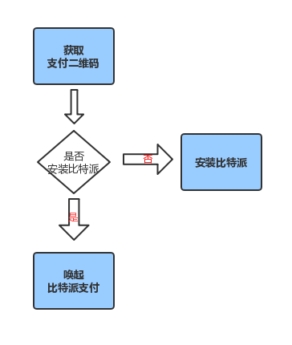

比特派 APP 唤起支付
=================================

比特派唤起流程图

说明：

1、通过比特派支付二维码 API 获取二维码。

2、判断是否安装比特派。

3、唤起比特派进行支付，支付之后可通过获取支付二维码状态来判断订单状态。

唤起比特派 Bitpie 登录
-----------------------------------

      ** API **
         * ``url`` *bitpie://piebank/pay?order_id={transfer_id}&amount={amount}&coin_code={coin_code}&app_name={app_name}*

      ** 参数 **
         * ``transfer_id`` *订单号*
         * ``amount`` *支付币数*
         * ``coin_code`` *币种代码*
         * ``app_name`` *应用名称*

      ** 回值 **

