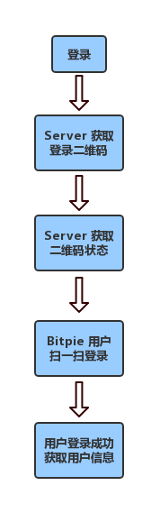

用户登录 API
====================================

用户登录 API 流程图

说明：

1、通过获取登录二维码 API 获取登录二维码。

2、通过比特派 APP 扫一扫功能扫描登录二维码。

3、通过对登录二维码状态 API 进行长轮询，共有4种状态（0:初始化,1:扫描,2:登录,3:超时)。可通过对这四种状态进行做对应的调试。

登录获取登录二维码
--------------------------

        ** 请求 API **:
            * ``url`` */api/v1/open/third/party/login/qr*
            * ``method`` *POST*
            * ``content-type`` *application/json*

        ** 参数 **:
            * ``appkey`` *(String)* - 参数类型, *(App 标识)*

        ** 返回值 **
            * ``time`` *时间戳*
            * ``hkey`` *QR标识*
            * ``qr_info``
            * ``qr_url`` *二维码地址*

        ** 返回值举例 **::

                {"qr_url": "http://****qr_img/d630dd0ee05c4535ad1e3985ae617212.png", "hkey": "00326d19351b490e1c90dc1073b5551b", "qr_info":"00326d19351b49sbc90dc1073b5551b","time": "1535011260"}

获取登录二维码状态
--------------------------------

        ** 请求  API **
            * ``url`` */api/v1/open/third/party/login/query/{hkey}*
            * ``method`` *GET*
            * ``content-type`` *application/json*

        ** 参数 **
            * ``hkey`` *QR标识*

        ** 返回值 **
            * ``hkey`` *QR标识*
            * ``status`` *登录状态值 0:初始化 1:扫描 2:登录 3:超时*

        ** 返回值举例 **::

                {"status": "2","hkey": "f0f3aa52ba2c4f3faf96f1115e89e05c"}


获取用户信息
-----------------------

        ** 请求 API **
            * ``url`` */api/v1/open/third/party/login/query/{hkey}*
            * ``method`` *POST*
            * ``content-type`` *application/json*

        ** 参数 **
            * ``appkey`` *(String)* -参数类型,*(App 标识)*

        ** 返回值 **
            * ``hkey`` *QR标识*
            * ``status`` *登录状态值 0:初始化 1:扫描 2:登录 3:超时*
            * ``token``
            * ``bitid``

        ** 返回值举例 **::

                {"status": "2","hkey": "525187332a0e4360972d8f1e53bb6306","token": "2119bfe22f4b41e7b595b84abce8824b","bitid": "****"}
