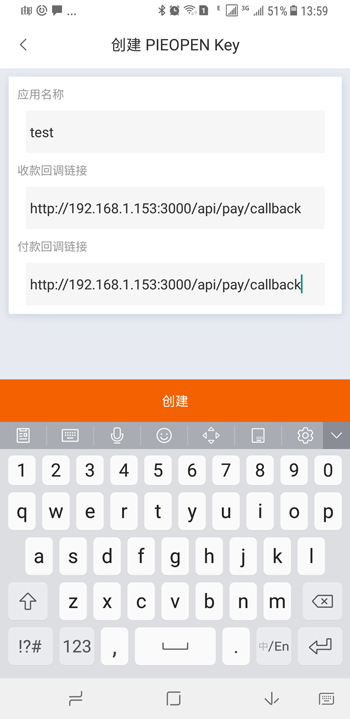

PIEOPEN KEY 注册
====================

1.比特派版本大于 3.5.1 。

2.打开比特派 APP 我的菜单，选择 PIEOPEN Key，选择右上解 "+"，输入应用名称、收款回调链接、付款回调链接。选择创建。这里的回调链接必须能通过网络访问的连接。

3.创建好 PIEOPEN Key 之后,可查看应用详情。应用名称（app_name）、App Key、Secret Key、收款回调链接、付款回调链接。

注意：因涉及资产安全，请仔细保管 PIEOPEN Key 信息，避免泄露。

